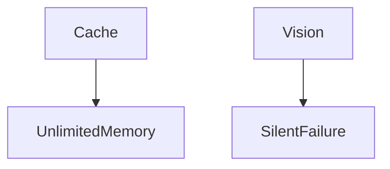
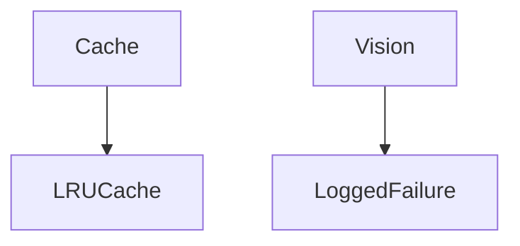

# CompuMark Common Law

## Before

## After

### Major Changes
- LRU image cache
- Exception logging

| Before | After |
|---|---|
| Unlimited cache | LRU |
| Silent failures | Logged |

**Unchanged:** Vision workflow and JSON schema.
