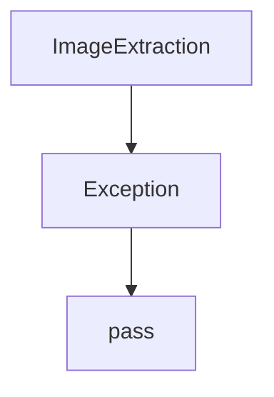
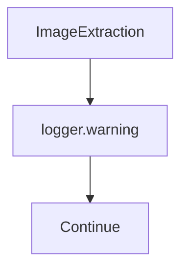

# Clarivate Common Law

## Before

## After

### Major Changes
- Warning logging for image extraction failures

| Before | After |
|---|---|
| Silent image failures | Logged |
| Same fallback | Same fallback |

**Unchanged:** Extraction flow, JSON schema, controller integration.
