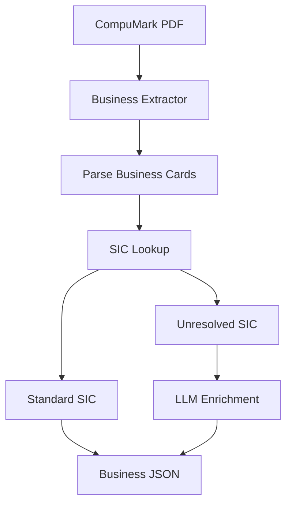
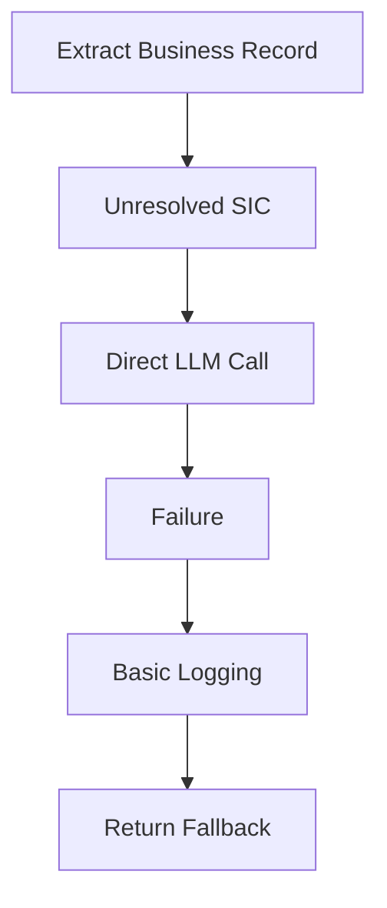
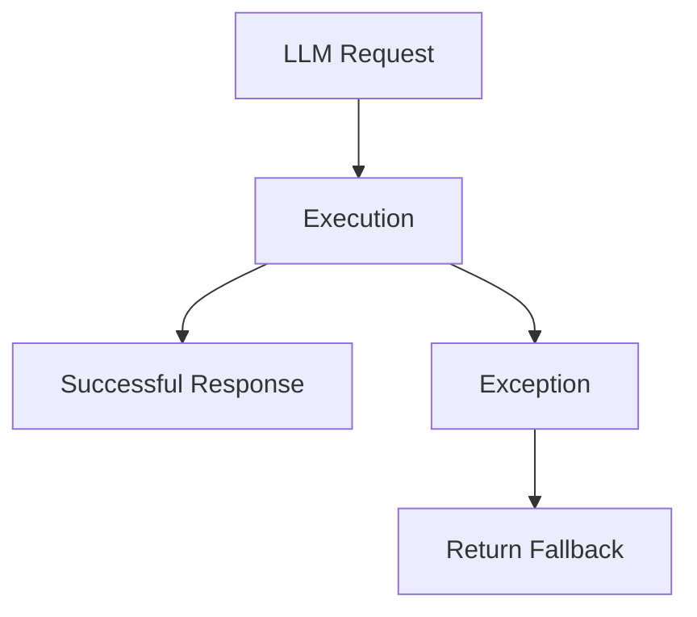
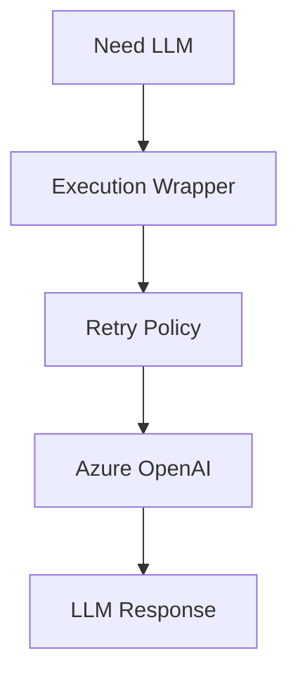
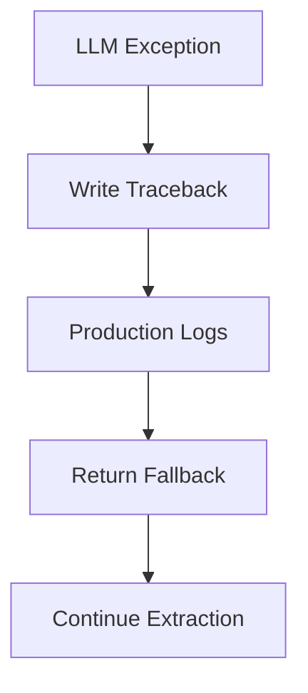
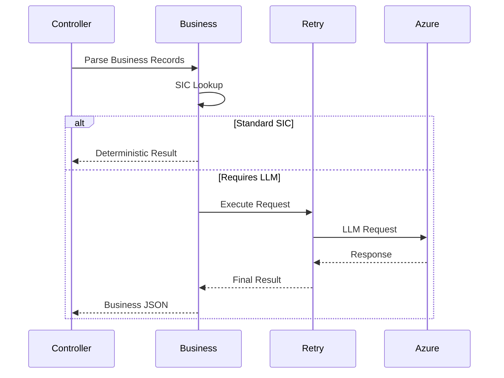
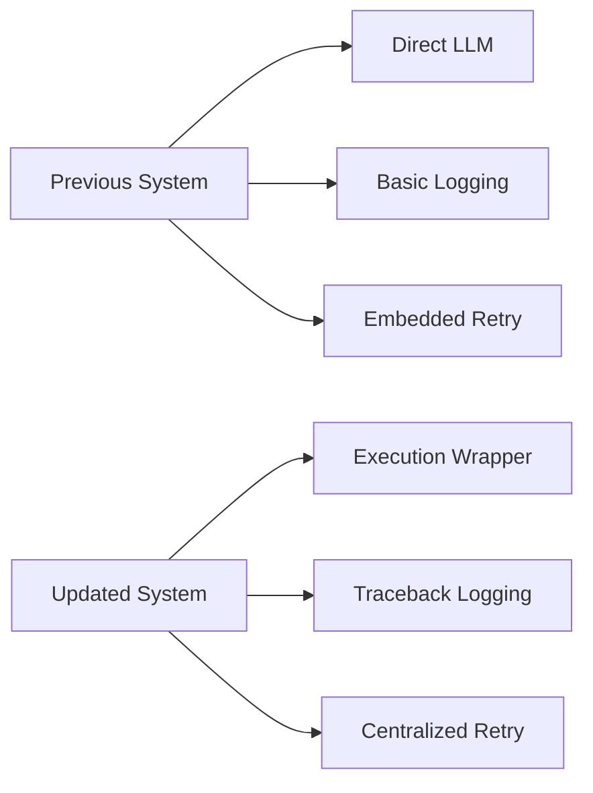

# CompuMark Business (`compumark_business.py`) – Engineering Refinements

# Executive Summary

`compumark_business.py` extracts **Business Name** records from CompuMark trademark reports. It parses BUS cards, maps Standard Industrial Classification (SIC) codes to Nice Classes, and invokes an LLM only for ambiguous **SIC 9999** records.

The recent engineering work focused on **resilience and observability**, not feature changes. The extraction logic, JSON schema, business rules, and concurrency model remain unchanged.

---

# Module Position in the Pipeline



Most records are resolved deterministically using `SIC_NICE_CROSSWALK`. Only unresolved SIC 9999 records require LLM enrichment.

---

# Previous System

## Overall Flow



The pipeline already protected extraction by returning fallback values when enrichment failed, but production diagnostics were limited.

---

# Engineering Issues

## Issue 1 — Limited Exception Observability

### Previous Behaviour

The LLM worker handled failures using generic exception handling and logged only the error message.

Typical failures included:

- Azure authentication failures
- Temporary network failures
- HTTP 429 rate limiting
- JSON parsing errors
- Unexpected runtime exceptions

Although extraction continued safely, production logs lacked the full traceback, making root-cause analysis difficult.

---

## Issue 2 — No Dedicated Retry Wrapper

The LLM invocation occurred directly inside `_infer_nice_class_via_llm()`.



There was no dedicated resilience layer encapsulating retry behaviour.

---

## Issue 3 — Thread Local Event Loop Documentation

The module intentionally used thread-local event loops for DuckDuckGo searches.

The implementation itself was correct, but the reasoning behind the design was not documented, making future maintenance easier after documentation was added.

---

# Implemented Engineering Improvements

## 1. Dedicated LLM Execution Wrapper

A dedicated helper function was introduced to centralize LLM execution.

The wrapper includes:

- maximum one retry
- exponential backoff
- centralized execution
- reusable resilience layer

### Current Flow



This separates resilience concerns from business logic.

---

## 2. Improved Exception Logging

Instead of simple message logging, the module now records complete stack traces using:

```
logger.exception(...)
```

### Current Behaviour



### Benefits

- Complete traceback visibility
- Easier production debugging
- No interruption to extraction

---

## 3. Better Internal Documentation

A descriptive docstring was added to the event-loop helper.

The implementation itself was intentionally left unchanged because the thread-local event-loop design is already compatible with the existing execution model.

---

# Before vs After

| Component | Before | After |
|-----------|--------|-------|
| LLM execution | Direct call | Dedicated wrapper |
| Retry organization | Embedded | Centralized |
| Exception logging | Message only | Full traceback |
| Event-loop explanation | Implicit | Documented |
| Business extraction | Unchanged | Unchanged |
| JSON schema | Unchanged | Unchanged |

---

# What Did NOT Change

The refinements deliberately avoided functional changes.

The following remain exactly the same:

- Business parsing logic
- SIC detection
- `SIC_NICE_CROSSWALK`
- ThreadPoolExecutor configuration
- DuckDuckGo search implementation
- `sync_search_web()`
- Event-loop behaviour
- Azure client creation
- LLM prompts
- JSON schema
- Controller integration

---

# Verification

The implementation was validated through dedicated resilience tests.

Covered scenarios:

- Successful LLM execution
- Retry wrapper execution
- Exception fallback
- Traceback logging verification
- Successful JSON parsing

All resilience tests passed successfully, confirming that reliability improvements did not alter functional behaviour.

---

# Current End-to-End Flow



---

# Engineering Benefits

The engineering improvements provide several operational advantages.

### Improved Production Observability

- Complete exception tracebacks
- Better production diagnostics
- Easier Azure troubleshooting

### Better Reliability

- Dedicated resilience wrapper
- Retry management isolated from business logic
- Consistent fallback behaviour

### Improved Maintainability

- Better documentation
- Cleaner separation of responsibilities
- Easier future enhancements

### Backward Compatibility

No changes were made to:

- extraction logic
- parsing behaviour
- JSON schema
- controller integration
- concurrency model

---

# Overall Before vs After



---

# Conclusion

The updated **CompuMark Business Extractor** remains functionally identical from the perspective of business extraction.

No parsing rules, SIC processing, JSON schema, controller integration, concurrency model, or business logic were modified.

The engineering improvements exclusively strengthen operational resilience by:

- introducing a dedicated LLM execution wrapper,
- centralizing retry handling,
- improving exception logging with complete tracebacks,
- documenting the thread-local event-loop implementation.

These refinements improve production readiness while maintaining complete backward compatibility with the existing extraction pipeline.
