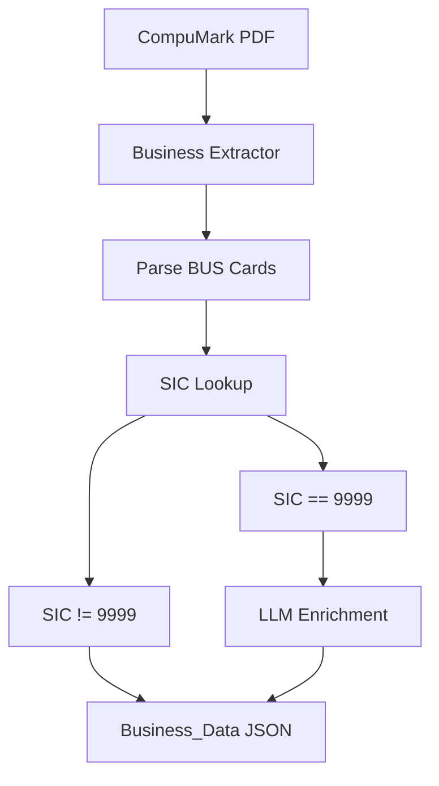
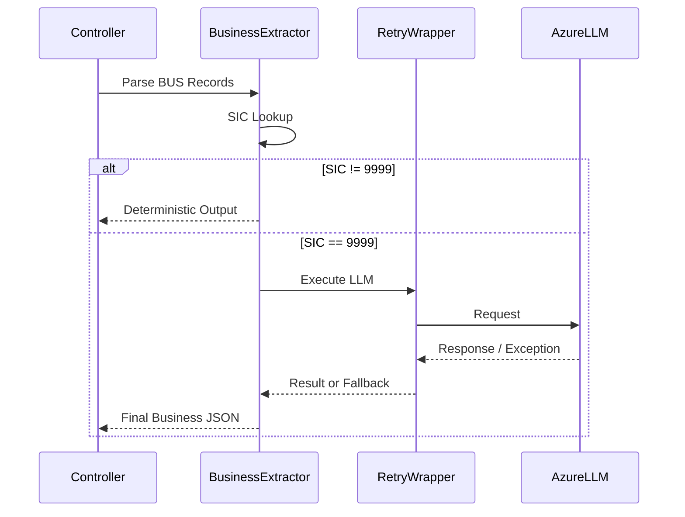

# CompuMark Business (`compumark_business.py`) – Engineering Refinements

# Executive Summary

`compumark_business.py` extracts **Business Name** records from CompuMark trademark reports. It parses BUS cards, maps Standard Industrial Classification (SIC) codes to Nice Classes, and invokes an LLM only for ambiguous **SIC 9999** records.

The recent engineering work focused on **resilience and observability**, not feature changes. The extraction logic, JSON schema, business rules, and concurrency model remain unchanged. fileciteturn43file0

---

# Module Position in the Pipeline



Most records are resolved deterministically using `SIC_NICE_CROSSWALK`. Only unresolved SIC 9999 records require LLM enrichment.

---

# Previous System

## Overall Flow

```mermaid
flowchart TD
    A[Extract Business Record]
    B[SIC 9999]
    C[Direct LLM Call]
    D[Failure]
    E[logger.error]
    F[Return {}]

    A-->B-->C-->D-->E-->F
```

The pipeline already protected extraction by returning an empty fallback dictionary when enrichment failed, but production diagnostics were limited.

---

# Engineering Issues

## Issue 1 – Limited Exception Observability

### Previous Behaviour

The LLM worker handled failures using generic exception handling and logged only the error message.

Typical failures included:

- Azure authentication failures
- Temporary network failures
- HTTP 429 rate limiting
- JSON parsing errors
- Unexpected runtime exceptions

Although extraction continued safely, production logs lacked the full traceback, making root-cause analysis difficult.

---

## Issue 2 – No Dedicated Retry Wrapper

The LLM invocation occurred directly inside `_infer_nice_class_via_llm()`.

```mermaid
flowchart TD
    A[LLM Call]
    B[Success?]
    C[Return Response]
    D[Exception]
    E[Fallback {}]

    A-->B
    B--Yes-->C
    B--No-->D-->E
```

There was no dedicated resilience layer encapsulating retry behaviour.

---

## Issue 3 – Thread-local Event Loop Documentation

The module intentionally used thread-local event loops for DuckDuckGo searches.

The implementation itself was correct, but the reasoning behind the design was not documented, making future maintenance harder.

---

# Implemented Engineering Improvements

## 1. Dedicated LLM Execution Wrapper

A dedicated helper:

```
_execute_compumark_llm_call()
```

was introduced.

It is decorated with a Tenacity retry policy:

- maximum one retry policy (`stop_after_attempt(1)` as configured)
- centralized execution path
- reusable wrapper

Current flow:

```mermaid
flowchart TD
    A[Need LLM]
    B[_execute_compumark_llm_call()]
    C[Tenacity]
    D[Azure LLM]
    E[Response]

    A-->B-->C-->D-->E
```

This separates resilience concerns from business logic.

---

## 2. Improved Exception Logging

Instead of simple message logging, the module now records complete stack traces using:

```
logger.exception(...)
```

Current behaviour:

```mermaid
flowchart TD
    A[LLM Exception]
    B[logger.exception]
    C[Full Traceback]
    D[Fallback {}]
    E[Continue Pipeline]

    A-->B-->C-->D-->E
```

Benefits:

- Complete traceback visibility
- Easier production debugging
- No interruption to extraction

---

## 3. Better Internal Documentation

A descriptive docstring was added to:

```
_get_or_create_event_loop()
```

The implementation itself was intentionally left unchanged because the thread-local event-loop design is compatible with the current execution model.

---

# Before vs After

| Component | Before | After |
|-----------|--------|-------|
| LLM execution | Direct call | Dedicated wrapper |
| Retry organization | Embedded | Centralized |
| Exception logging | Message only | Full traceback |
| Event-loop explanation | Implicit | Documented |
| Business extraction | Unchanged | Unchanged |
| JSON schema | Unchanged | Unchanged |

---

# What Did NOT Change

The refinements deliberately avoided functional changes.

Unchanged components include:

- Business parsing logic
- SIC detection
- `SIC_NICE_CROSSWALK`
- ThreadPoolExecutor (`max_workers=3`)
- DuckDuckGo search implementation
- `sync_search_web()`
- `_get_or_create_event_loop()` behaviour
- Azure client creation
- LLM prompts
- JSON schema
- Controller integration

---

# Verification

The implementation was validated through dedicated resilience tests.

Covered scenarios:

- Successful LLM execution
- Retry wrapper execution
- Exception fallback
- `logger.exception()` verification
- Successful JSON parsing

All resilience tests passed successfully, confirming that reliability improvements did not alter functional behaviour. fileciteturn43file0

---

# Current End-to-End Flow



---

# Engineering Benefits

- Improved production observability.
- Centralized resilience logic.
- Easier debugging through full stack traces.
- Better maintainability via documented thread-local event-loop design.
- Zero impact on extraction accuracy or business rules.

---

# Conclusion

The updated `compumark_business.py` remains functionally identical from the perspective of extraction. The improvements exclusively strengthen operational resilience and maintainability by introducing a dedicated LLM execution wrapper, improving exception logging, and documenting the thread-local event-loop design.

No changes were made to business extraction logic, JSON schema, concurrency model, SIC processing, or downstream controller integration, ensuring complete backward compatibility while improving production readiness.
