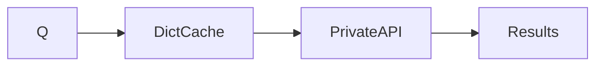
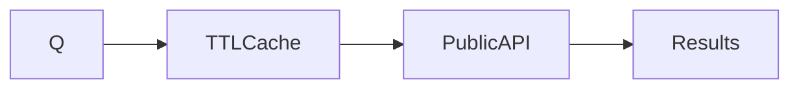

# DuckDuckGo Tool

## Before

## After

### Major Changes
- TTL bounded cache
- Public `ddgs.text()` API

| Before | After |
|---|---|
| Unlimited cache | TTL + max size |
| Private methods | Public API |

**Unchanged:** Ranking, deduplication, output format.
