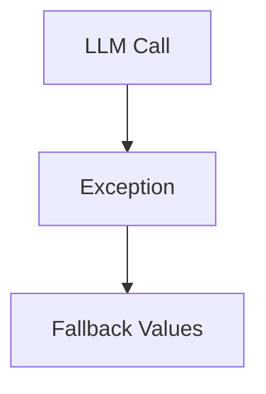
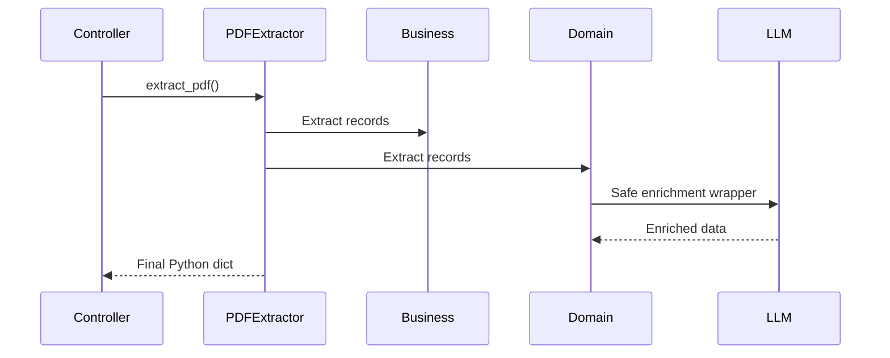

# Fovea PDF Extractor (`fove_pdf_extract.py`)

# Executive Summary

`fove_pdf_extract.py` is the primary extractor for **Fovea PDF reports**. It orchestrates extraction of:

- Applicant information
- Business records
- Domain records
- Web Common Law records
- TOC metadata

Unlike vendor-specific helper modules, this file coordinates multiple extraction stages and enrichment pipelines before producing the final Python dictionary returned to the main controller.

The recent engineering work focused on **runtime robustness**, **event-loop safety**, and **production observability**. No extraction algorithms or JSON structures were modified.

---

# Position in the Overall Pipeline

```mermaid
flowchart TD
    A[Fovea PDF]
    B[extract_pdf()]
    C[Applicant Metadata]
    D[Business Extraction]
    E[Domain Extraction]
    F[Web Common Law]
    G[LLM Enrichment]
    H[Final Python Dict]

    A-->B
    B-->C
    B-->D
    B-->E
    B-->F
    D-->G
    E-->G
    F-->H
    G-->H
```

This module is invoked by `vender_detection_state.py` after vendor detection identifies a Fovea PDF.

---

# Previous System

## CLI Execution

The standalone CLI path attempted:

```text
serialize_json_payload(result)
```

However, this serializer was not defined in the module.

### Previous Flow

```mermaid
flowchart TD
    A[main()]
    B[Extract PDF]
    C[serialize_json_payload()]
    D[NameError]
    E[CLI Crash]

    A-->B-->C-->D-->E
```

### Impact

- Normal production pipeline unaffected.
- Standalone CLI execution failed immediately.

---

## Domain Enrichment

The domain enrichment stage directly executed:

```text
asyncio.run(_run_domain_enrichment(...))
```

### Previous Flow

```mermaid
flowchart TD
    A[extract_domain_data()]
    B[asyncio.run()]
    C[Running Event Loop?]
    D[RuntimeError]

    A-->B-->C-->D
```

This worked in synchronous execution but failed when invoked from environments already running an asyncio loop (for example FastAPI).

---

## Exception Handling

Business and domain enrichment contained fallback logic, but failures were only partially observable.



Extraction continued, but diagnosing Azure failures, authentication issues, or rate limits was difficult.

---

# Engineering Improvements

## 1. CLI Serialization

The undefined serializer was replaced with direct JSON serialization using `orjson.dumps()`.

### Current Flow

```mermaid
flowchart TD
    A[main()]
    B[Extract PDF]
    C[orjson.dumps()]
    D[Indented JSON]

    A-->B-->C-->D
```

Result:

- CLI now produces valid JSON.
- No production behavior changed.

---

## 2. Event-Loop Safe Domain Enrichment

A dedicated wrapper (`_execute_domain_enrichment`) now determines the execution strategy.

### Current Flow

```mermaid
flowchart TD
    A[extract_domain_data()]
    B[Running Event Loop?]
    C[Background Thread]
    D[asyncio.run()]
    E[Enrichment Complete]

    A-->B
    B--Yes-->C-->E
    B--No-->D-->E
```

Benefits:

- Safe inside synchronous scripts.
- Safe inside asynchronous servers.
- No changes to enrichment logic.

---

## 3. Improved Exception Logging

The fallback behavior was preserved, but exception logging now records complete tracebacks.

### Current Flow

```mermaid
flowchart TD
    A[LLM Enrichment]
    B[Exception]
    C[logger.exception()]
    D[Fallback Values]
    E[Continue Extraction]

    A-->B-->C-->D-->E
```

The pipeline remains fault tolerant while becoming significantly easier to debug.

---

# Before vs After

| Component | Before | After |
|-----------|--------|-------|
| CLI execution | NameError | Valid JSON output |
| Domain enrichment | `asyncio.run()` only | Event-loop safe wrapper |
| Exception handling | Limited visibility | Full traceback logging |
| Extraction logic | Unchanged | Unchanged |
| JSON schema | Unchanged | Unchanged |

---

# What Did NOT Change

The engineering work intentionally avoided functional modifications.

The following remain identical:

- Applicant extraction
- Business extraction
- Domain parsing
- Web Common Law extraction
- Image_Base64 implementation
- market_place enrichment
- Parallel execution model
- LLM prompts
- JSON schema
- Output dictionary structure
- Controller integration

---

# End-to-End Execution



---

# Engineering Benefits

- CLI execution is fully functional.
- Compatible with FastAPI and other async frameworks.
- Better production diagnostics through traceback logging.
- Improved reliability without altering extraction accuracy.
- Fully backward compatible with existing controller flow.

---

# Conclusion

The updated `fove_pdf_extract.py` is functionally identical to the previous implementation from an extraction perspective. The improvements exclusively strengthen runtime reliability by fixing CLI execution, making domain enrichment safe in asynchronous environments, and improving observability through structured exception logging.

No parsing logic, enrichment behavior, JSON schema, or downstream integration was changed, ensuring complete backward compatibility while increasing production readiness.
