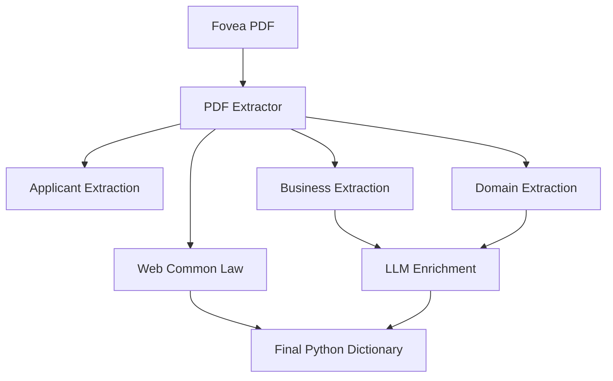
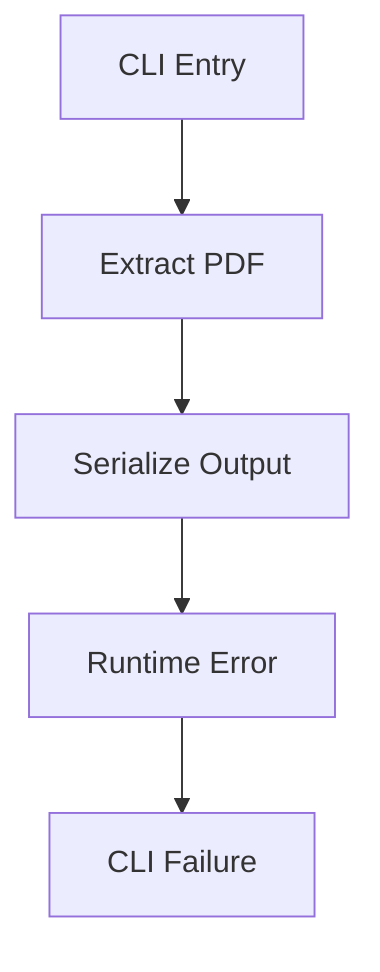
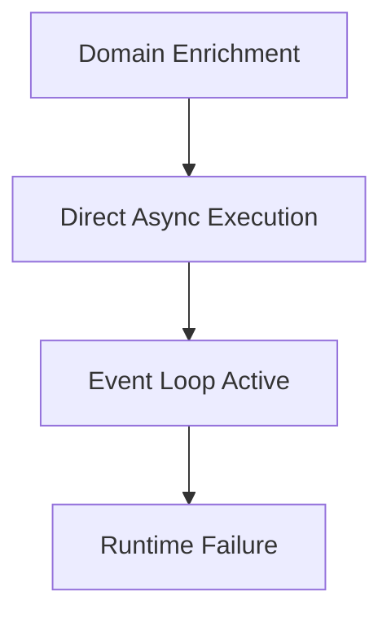
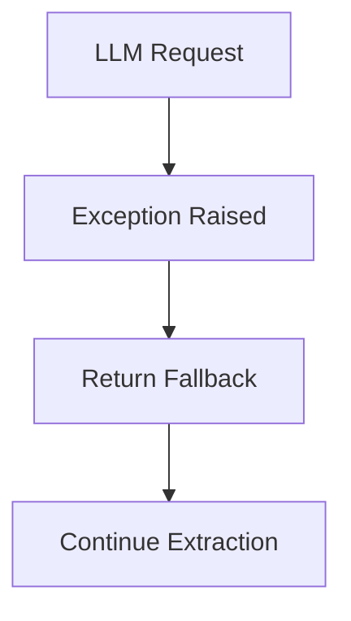
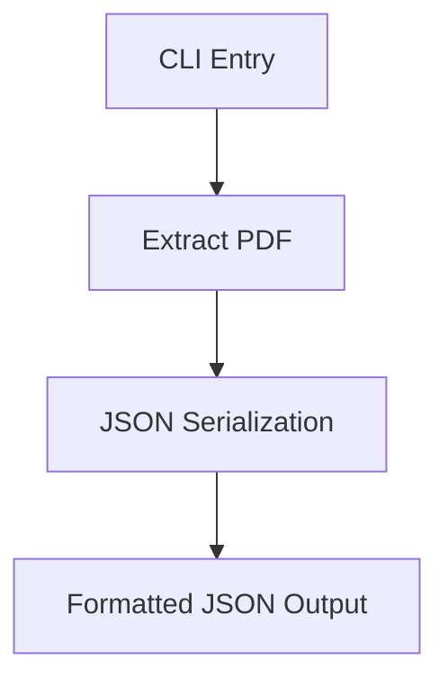
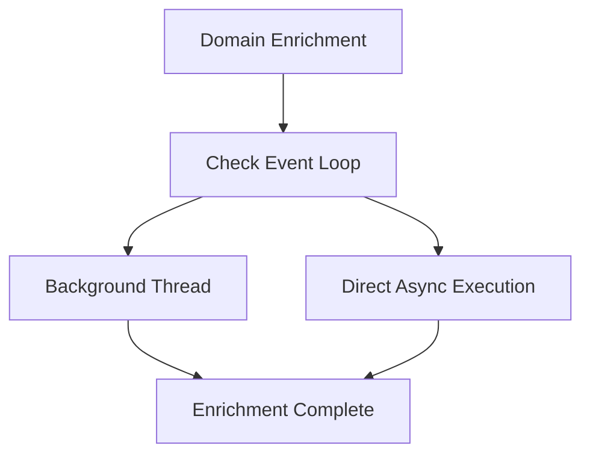
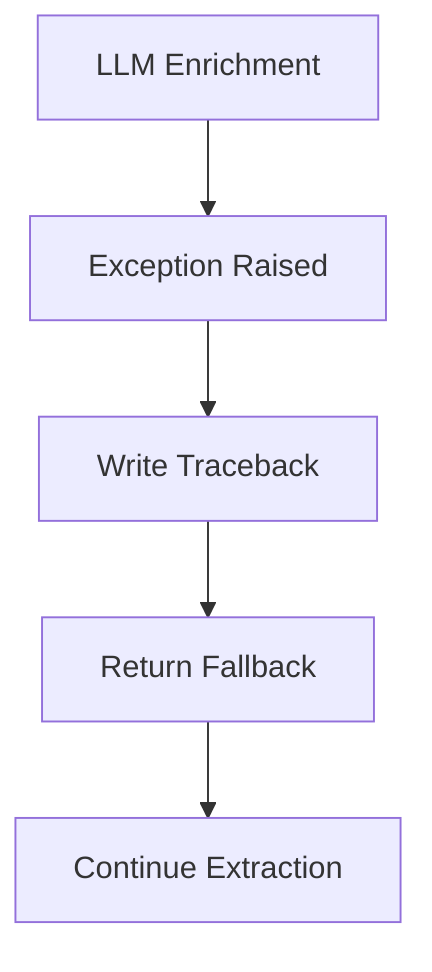
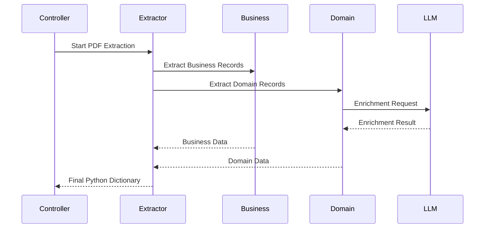
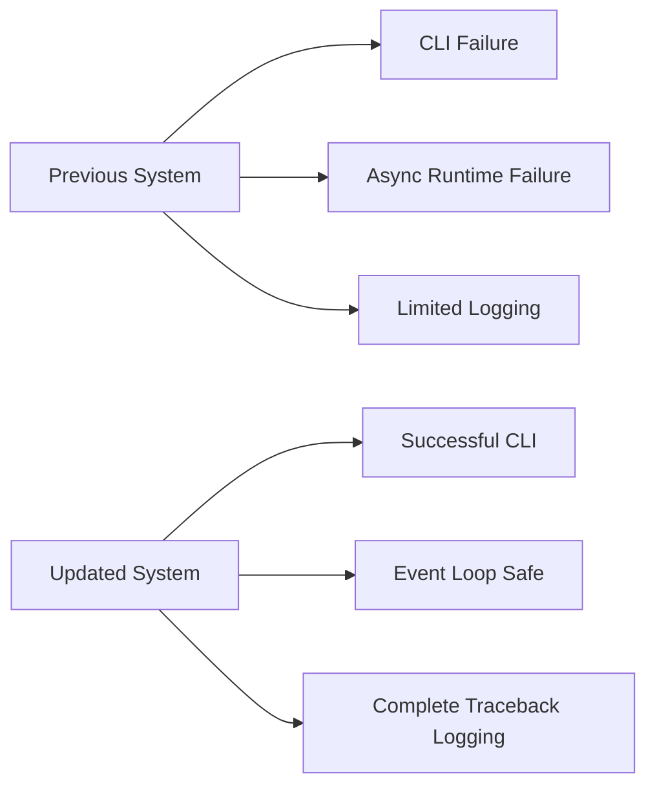

# Fovea PDF Extractor (`fove_pdf_extract.py`)

# Executive Summary

`fove_pdf_extract.py` is the primary extractor responsible for processing **Fovea PDF reports**. It coordinates the complete extraction workflow, including:

- Applicant information
- Business records
- Domain records
- Web Common Law records
- Table of Contents (TOC) metadata

Unlike the vendor-specific helper modules, this file acts as the orchestration layer for the Fovea PDF pipeline. It coordinates multiple extraction stages and enrichment pipelines before producing the final Python dictionary that is returned to the main controller.

The recent engineering improvements focused exclusively on **runtime robustness**, **event-loop safety**, and **production observability**. No extraction algorithms, parsing logic, business rules, or JSON structures were modified.

---

# Module Position in the Overall Pipeline

This module is invoked by the main controller after vendor detection identifies the uploaded document as a **Fovea PDF**.

---

# Previous System

## CLI Execution

The standalone CLI execution path attempted to serialize the extraction result using an internal serializer.

However, the serializer function did not exist inside the module.

As a result, standalone execution terminated immediately with a runtime error.

### Previous Flow

### Impact

- Production pipeline remained unaffected.
- Controller-based execution worked correctly.
- Standalone CLI execution always failed.

---

# Previous Domain Enrichment

The domain enrichment stage directly executed asynchronous enrichment.

This worked correctly for synchronous execution.

However, if the extractor was executed inside an already running asynchronous environment (for example FastAPI), the runtime raised an event-loop error.

### Previous Flow

### Impact

- Normal command-line execution succeeded.
- Async server execution could fail.
- Domain enrichment became incompatible with existing event loops.

---

# Previous Exception Handling

Business and Domain enrichment already contained fallback logic.

If the LLM failed, extraction continued.

However, only limited diagnostic information was available.

### Previous Flow

### Impact

The extraction pipeline remained stable, but production debugging became difficult because complete exception tracebacks were not available.

---

# Engineering Improvements

The engineering work introduced three targeted reliability improvements while intentionally preserving every functional aspect of the extractor.

---

# Improvement 1 — CLI Serialization

The undefined serializer was replaced with direct JSON serialization using `orjson`.

No changes were made to the extracted data itself.

Only the serialization mechanism was corrected.

### Current Flow

### Benefits

- Standalone CLI execution now works correctly.
- Valid JSON is produced.
- No impact on controller execution.
- No impact on extraction accuracy.

---

# Improvement 2 — Event-Loop Safe Domain Enrichment

A dedicated execution wrapper now determines how asynchronous enrichment should be executed.

The wrapper performs two possible execution paths.

If no event loop is active:

- execute enrichment normally.

If an event loop is already running:

- execute enrichment inside a background thread.

### Current Flow

### Benefits

- Compatible with synchronous applications.
- Compatible with asynchronous servers.
- Compatible with FastAPI.
- No changes to enrichment logic.
- No changes to returned JSON.

---

# Improvement 3 — Better Exception Logging

The fallback behaviour remains exactly the same.

The only improvement is that exceptions are now recorded with complete tracebacks before returning fallback values.

### Current Flow

### Benefits

- Complete production diagnostics.
- Easier Azure troubleshooting.
- Easier network debugging.
- Easier authentication debugging.
- Extraction never stops because of LLM failures.

---

# Before vs After

| Component | Before | After |
|-----------|--------|-------|
| CLI execution | Runtime failure | Valid JSON output |
| Domain enrichment | Direct async execution | Event-loop safe execution |
| Exception handling | Limited diagnostics | Complete traceback logging |
| Extraction logic | Unchanged | Unchanged |
| JSON schema | Unchanged | Unchanged |
| Controller integration | Unchanged | Unchanged |

---

# What Did NOT Change

The engineering work intentionally avoided functional modifications.

The following components remain exactly the same:

- Applicant extraction
- Business extraction
- Domain extraction
- Web Common Law extraction
- Image Base64 implementation
- Market Place enrichment
- LLM prompts
- ThreadPool execution
- JSON schema
- Output dictionary structure
- Controller integration
- Parsing algorithms
- Extraction accuracy

This guarantees complete backward compatibility.

---

# End-to-End Execution

---

# Engineering Benefits

The engineering improvements provide several important operational advantages.

### Improved Runtime Stability

- Standalone CLI execution now succeeds.
- JSON serialization is reliable.

### Better Async Compatibility

- Safe execution inside asynchronous frameworks.
- Compatible with FastAPI.
- Eliminates event-loop conflicts.

### Improved Observability

- Complete exception tracebacks.
- Easier production debugging.
- Better Azure diagnostics.

### Improved Reliability

- Fallback behaviour remains unchanged.
- Extraction continues even when enrichment fails.
- No interruption to downstream processing.

---

# Overall Before vs After

---

# Conclusion

The updated **Fovea PDF Extractor** remains functionally identical from an extraction perspective.

No parsing rules, enrichment algorithms, business logic, JSON schema, or controller integration were modified.

The engineering improvements exclusively strengthen the runtime infrastructure by:

- fixing standalone CLI execution,
- making domain enrichment compatible with asynchronous environments,
- improving exception observability through complete traceback logging.

As a result, the extractor is significantly more robust for production deployments while maintaining complete backward compatibility with the existing extraction pipeline.
