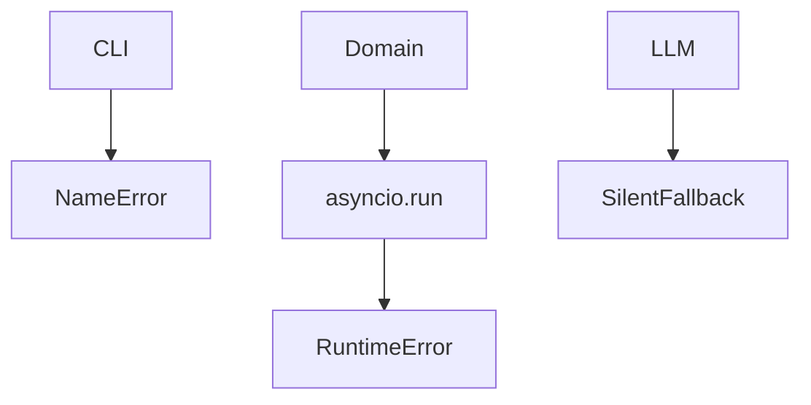
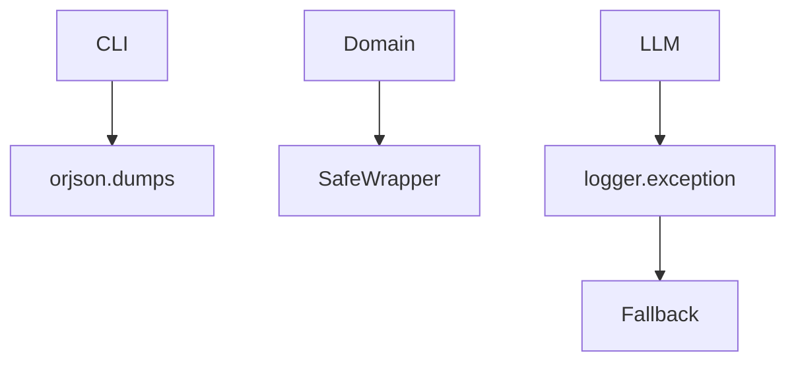

# Fovea PDF Extractor

## Before

## After

### Major Changes
- CLI serializer fixed
- Event-loop-safe domain enrichment
- Exception logging

| Before | After |
|---|---|
| CLI crash | Valid JSON |
| Async unsafe | Async safe |
| Silent errors | Tracebacks |

**Unchanged:** Extraction logic, JSON schema.
