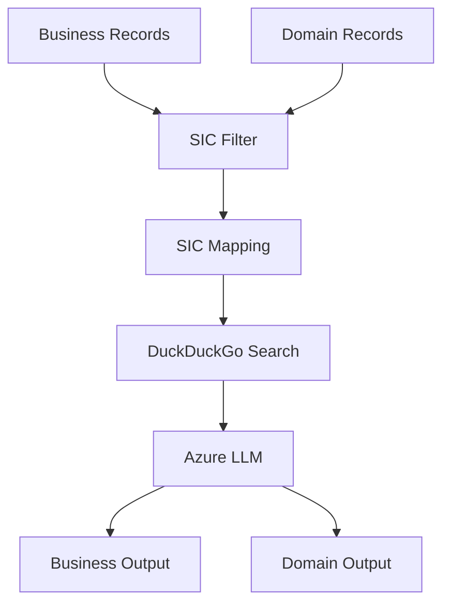
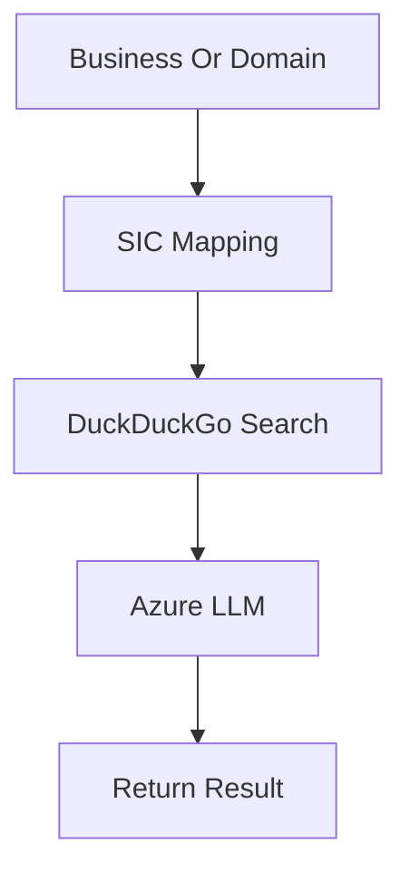
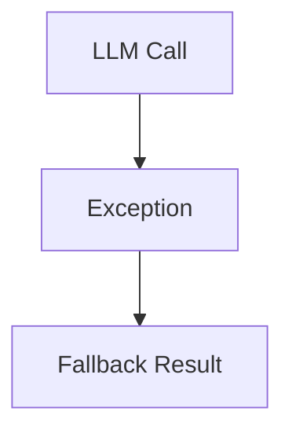
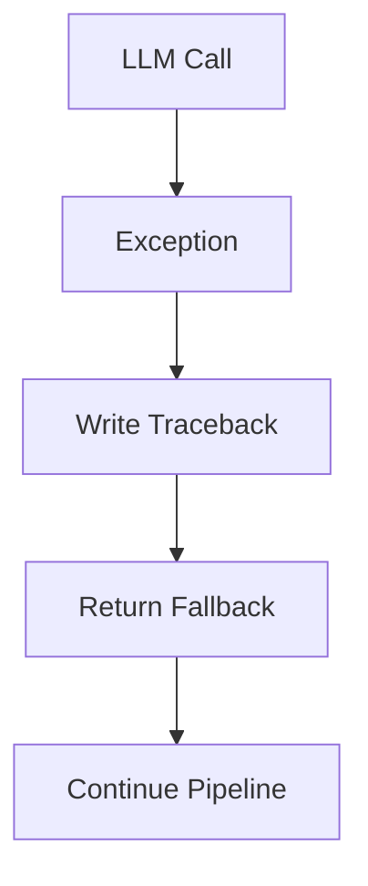
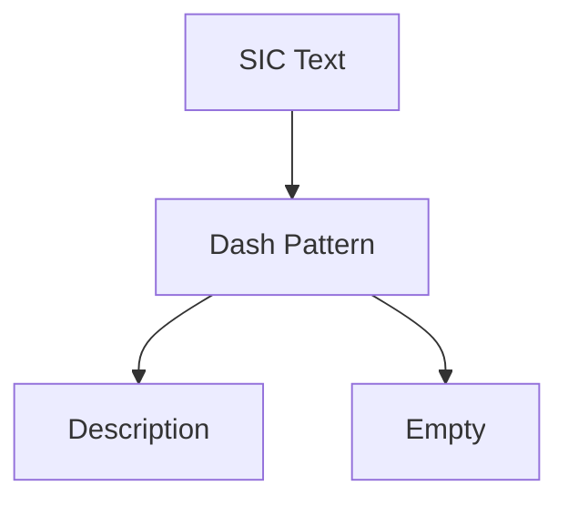
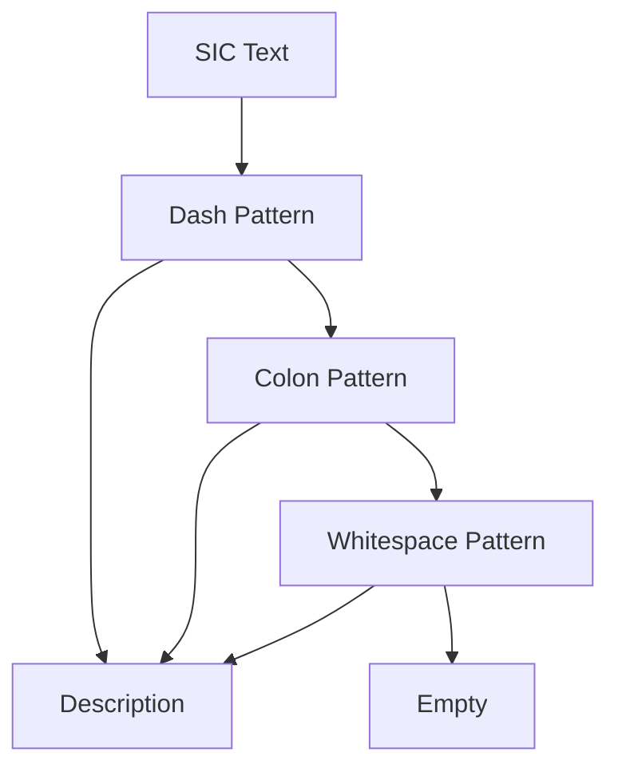
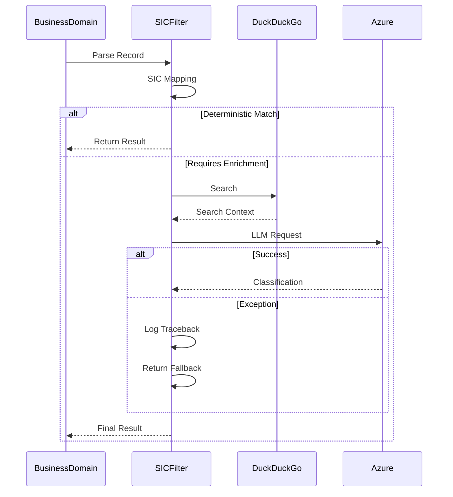

# Business & Domain SIC Filter (`sic_filter.py`)
# Engineering Refinements Documentation

---

# Executive Summary

`sic_filter.py` is the core Business/Domain classification engine used by the Corsearch pipeline.

Its primary responsibilities are:

- Mapping SIC codes to Nice Classes
- Executing DuckDuckGo searches
- Calling Azure OpenAI for unresolved classifications
- Returning standardized Business and Domain enrichment data

The engineering refinements focused entirely on **reliability**, **observability**, and **parser resilience**.

No business logic, prompt engineering, controller flow, or JSON schema was modified.

---

# Module Position in Overall Pipeline



This module sits between the Corsearch extractors and the final Business/Domain JSON generation.

---

# Previous System

The previous implementation already contained a solid enrichment pipeline.

For every Business or Domain record:

1. Parse SIC code.
2. Perform deterministic SIC mapping.
3. Execute DuckDuckGo search if needed.
4. Call Azure OpenAI.
5. Return enrichment result.

---

## Previous Execution Flow



Functionally, this worked correctly.

However, two engineering weaknesses existed.

---

# Engineering Issue 1

## Limited Exception Visibility

Several helper functions contained:

```python
try:
    ...
except Exception:
    return fallback
```

Failures were handled correctly.

The pipeline never crashed.

However,

- Azure authentication failures
- HTTP 429
- network failures
- malformed responses
- parsing failures

were hidden because no complete traceback was written.

Production debugging became extremely difficult.

---

## Previous Error Handling



Only fallback values were returned.

Very little diagnostic information existed.

---

# Engineering Improvement 1

Exception logging was upgraded.

Instead of only returning fallback values,

the helper now records

- complete traceback
- exception type
- call stack

using

```
logger.exception(...)
```

before returning the fallback.

---

## Current Error Handling



Benefits

- Better production debugging
- Easier Azure issue diagnosis
- Zero behavior change

---

# Engineering Issue 2

## Brittle SIC Description Parsing

Previously,

`extract_sic_description()`

expected only one format.

Example:

```
1234 - Manufacturing
```

The regex assumed a dash separator.

Examples such as

```
1234 : Manufacturing

1234 Manufacturing
```

were not parsed correctly.

Although the extraction continued,

the returned description became empty.

---

## Previous Parsing



Only one formatting style was accepted.

---

# Engineering Improvement 2

The parser now keeps the original dash parser as the primary method.

If that fails,

additional parsing handles:

- colon separator
- whitespace separator

without changing the original logic.

---

## Current Parsing



This significantly improves parser resilience while preserving the existing parsing strategy.

---

# Before vs After

| Area | Before | After |
|------|---------|--------|
| Exception Logging | Limited | Complete traceback |
| Azure Failure Visibility | Low | High |
| SIC Parsing | Dash only | Dash plus Colon plus Whitespace |
| Business Logic | Same | Same |
| LLM Prompts | Same | Same |
| DuckDuckGo Search | Same | Same |
| JSON Schema | Same | Same |

---

# What Did NOT Change

The engineering refinement intentionally avoided functional modifications.

No changes were made to:

- Azure client configuration
- LLM prompts
- Instructor usage
- DuckDuckGo implementation
- Event loop implementation
- Thread-local client
- Controller integration
- Business pipeline
- Domain pipeline
- JSON schema
- Nice Class generation
- Goods and Services generation

The execution flow remains completely identical.

---

# Verification

Dedicated resilience tests were added.

The verification covered:

## SIC Parsing

Verified all supported formats:

- Dash
- Colon
- Whitespace
- Empty string

All parsed successfully.

---

## Exception Logging

Azure failures were mocked.

The tests verified:

- logger.exception invoked
- traceback recorded
- fallback returned

No pipeline interruption occurred.

All verification tests passed successfully.

---

# Current Execution Flow



---

# Engineering Benefits

The updated implementation provides:

- Better production observability
- Complete traceback logging
- More robust SIC parsing
- Improved support for future formatting variations
- Better maintainability
- Zero changes to extraction behavior
- Full backward compatibility

---

# Conclusion

The updated `sic_filter.py` remains architecturally identical to the previous implementation.

The engineering work focused on strengthening reliability rather than changing functionality.

The Business and Domain enrichment flow, controller integration, LLM prompts, concurrency model, and JSON schema remain exactly the same.

The only improvements are:

- Complete exception visibility through structured logging.
- More resilient SIC description parsing.

These refinements improve production readiness while preserving the existing extraction pipeline.