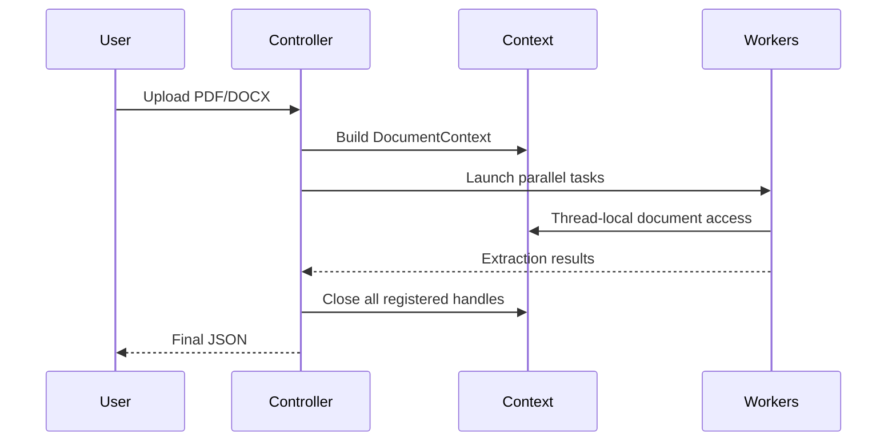

# Vendor Detection Controller (`vender_detection_state.py`)

# Executive Summary

`vender_detection_state.py` is the central orchestration layer of the trademark extraction pipeline. It validates incoming files, detects the report vendor, constructs a shared `DocumentContext`, launches parallel extraction branches, and merges all outputs into the final JSON payload.

The recent engineering improvements focused on **resource lifecycle management** rather than changing extraction logic. The objective was to improve long-running production stability while preserving complete backward compatibility.

---

# Position in the Overall Architecture

```mermaid
flowchart TD
    A[PDF / DOCX]
    B[validate_input_file()]
    C[Vendor Detection]
    D[DocumentContext]
    E[ThreadPoolExecutor]
    F[State Law]
    G[Common Law]
    H[Business]
    I[Domain]
    J[Merge Results]
    K[Final JSON]

    A-->B-->C-->D-->E
    E-->F
    E-->G
    E-->H
    E-->I
    F-->J
    G-->J
    H-->J
    I-->J
    J-->K
```

The controller does **not** perform extraction itself. Its responsibility is orchestration, lifecycle management, concurrency, and result aggregation.

---

# Previous System

## Resource Lifecycle

Before the engineering refinement, worker threads opened their own PyMuPDF/pdfplumber handles through the shared `DocumentContext`. However, cleanup primarily occurred from the caller thread.

```mermaid
flowchart TD
    A[DocumentContext]
    B[Worker Thread]
    C[get_fitz_doc()]
    D[Thread-local Handle]
    E[close()]
    F[Caller Thread Resources Closed]

    A-->B-->C-->D-->E-->F
```

## Engineering Concern

Although extraction continued to work correctly, long-running services processing many documents could accumulate thread-local resources that were not centrally tracked.

Potential impact:

- File descriptor growth
- Increased memory usage
- Resource retention in worker threads

No JSON corruption or extraction failures occurred.

---

# Engineering Improvements

## 1. Central Resource Tracking

A thread-safe registry was introduced to register every document handle created by worker threads.

Benefits:

- Every handle becomes visible to the controller.
- Cleanup is deterministic.
- Multiple worker threads are supported safely.

---

## 2. Complete Cleanup

Instead of cleaning only the current thread's resources, the controller now closes every registered handle.

```mermaid
flowchart TD
    A[Worker Opens Document]
    B[Register Handle]
    C[Global Registry]
    D[Controller close()]
    E[Close All Handles]

    A-->B-->C-->D-->E
```

---

## 3. Safer Import Bootstrap

Startup path handling was made more defensive without changing runtime behavior.

This improves portability while keeping the existing project structure intact.

---

# Before vs After

| Area | Before | After |
|------|--------|-------|
| Worker handle tracking | Implicit | Explicit registry |
| Cleanup | Caller-thread focused | Global cleanup |
| Resource leaks | Possible in long-lived services | Prevented |
| Import bootstrap | Basic | Defensive |

---

# What Did NOT Change

The engineering work intentionally avoided changing any business logic.

Unchanged components include:

- Vendor detection
- Clarivate pipeline
- Corsearch pipeline
- CompuMark pipeline
- Fovea PDF pipeline
- Fovea DOCX pipeline
- ThreadPool architecture
- JSON schema
- Image extraction
- Image_Base64
- market_place enrichment
- Business extraction
- Domain extraction
- Common Law extraction
- State Law extraction

---

# Current Execution Flow



---

# Engineering Benefits

- Improved resource lifecycle management.
- Better stability for long-running services.
- Safer concurrent execution.
- Easier maintenance.
- Zero impact on extraction accuracy.
- Fully backward compatible.

---

# Conclusion

The controller remains architecturally identical from a functional perspective. The improvements strengthen infrastructure concerns—resource ownership, cleanup, and robustness—without modifying parsing logic, vendor routing, concurrency strategy, or output schema.

The result is a more production-ready orchestration layer while preserving complete compatibility with every downstream extractor.
